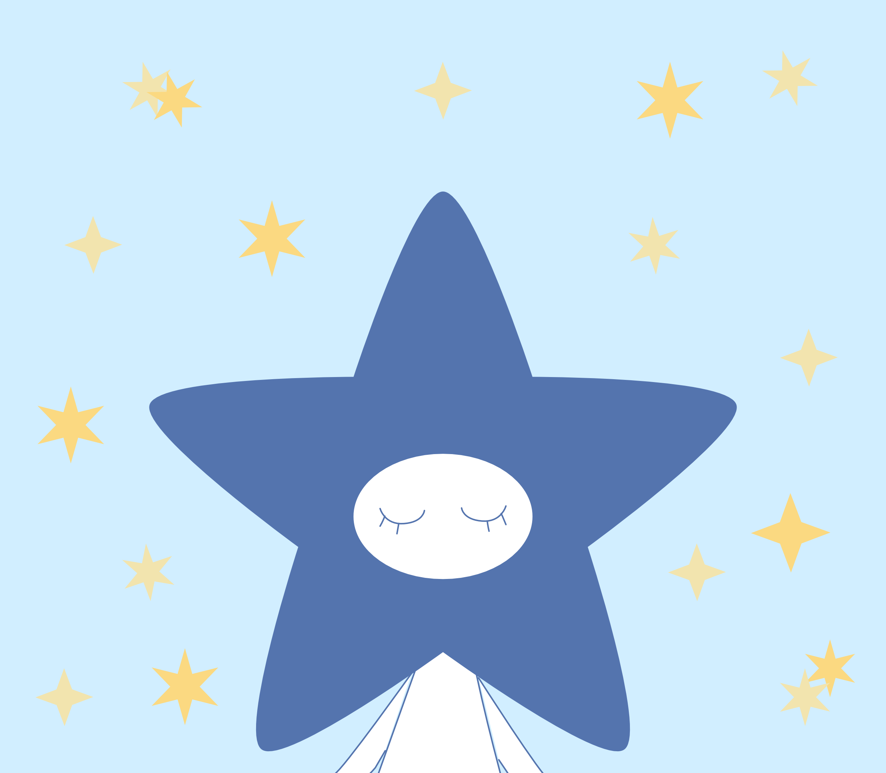
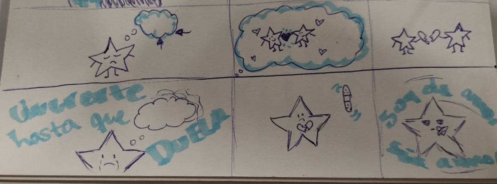

# proyecto-pensamiento-computacional-s5
examen de s5 pensamiento computacional

# neo roneo 
Rusowsky, LATIN MAFIA(2024). Neo Roneo [canción]

 

Frida Gonzales https://github.com/frrrida 

Constanza Seyssel https://github.com/constanzaseyssel-source 

 https://editor.p5js.org/frrrida/sketches/P3W7mBcU8

# Relato inicial 

 El origen de nuestro proyecto nace a base de la letra de la canción, en donde habla de como se
 se siente la persona con la ausencia del amor de su ex-pareja. Nosotras quisimos representarlo atraves de una estrella, representando un poco el sello que tiene la portada de la canción, y la idea era que en este proyecto se ayudara a la estrella a sentirse mejor intentando "curar" su corazón basandonos en la frase que mas se repite de la canción que dice "de tu amor yo no sé si me recuperaré"

# Storyboard inicial
boceto de como queriamos que fuera, luego de eso los dibujos se realizaron en digital 
 

# Primer estado

Se muestra a nuestra estrella protagonista con una nube al lado de su cabeza representando sus pensamientos. La nube contiene un lebe tintineo en donde es le señala al espectador que debe hacer click ahí. 

 if(escena == 1){

  image(estrella1,0,0,width,height);

  brilloNube = 180 + 75 * sin(frameCount*0.08);

  tint(255,brilloNube);

  image(nube1,0,0,width,height);
  image(contornonube,0,0,width,height);

  noTint();

  if(crecerNube){

    tamanoNube = tamanoNube + 35;

    image(
      nube1,
      width/2 - tamanoNube/2,
      height/2 - tamanoNube/2,
      tamanoNube,
      tamanoNube
    );

    image(
      contornonube,
      width/2 - tamanoNube/2,
      height/2 - tamanoNube/2,
      tamanoNube,
      tamanoNube
    );

    if(tamanoNube > 1800){

      escena = 2;

    }

  }

}

# Segundo estado 

Al hacer click en la nube, se realiza un zoom para poder mostrar que nuestra estrella esta tristre, ya que recuerda a su ex-pareja, cuando todo estaba bien. 

   if(escena == 2){

  background(203,214,233);

  image(parejita,0,0,width,height);

  image(corazones,0,0,width,height);

  latido = 12 * sin(frameCount*0.12);

 image(
    corazon,
    -latido/2,
    -latido/2,
    width + latido,
    height + latido
);

}

# Tercer estado

En medio de ellos se encuentra un corazón, tambien con un leve tintinei, al tocarlo el corazón se rompe mostrandonos el por qué de que nuestra estrella este mal. 

Para pasar al cuarto estado, deben borra el recuerdo con el mismo mouse. 

(sin texto) 

if(escena == 3){

  // Dibujamos primero la escena 4 debajo
  background(203,214,233);

  image(nube2,0,0,width,height);

  image(estrellatriste,0,0,width,height);

  moverLagrimas = 4 * sin(frameCount * 0.12);

  image(
    lagrimas,
    0,
    moverLagrimas,
    width,
    height
  );

  // Encima dibujamos el pensamiento

  tint(255, transparenciaPensamiento);

  background(243,244,255);

  image(parejatriste,0,0,width,height);

  noTint();

  if(transparenciaPensamiento <= 0){

      escena = 4;

  }

}

(con texto) 

if (escena == 3) {

  // Dibujamos primero la escena 4 debajo
  background(203,214,233);

  image(nube2, 0, 0, width, height);
  image(estrellatriste, 0, 0, width, height);

  moverLagrimas = 4 * sin(frameCount * 0.12);

  image(
    lagrimas,
    0,
    moverLagrimas,
    width,
    height
  );

  // TEXTO DE FONDO
  fill(255);
  textSize(42);
  textAlign(CENTER, CENTER);

  // Parte normal
  textStyle(NORMAL);
  text("así te veo a ti", width/2, height/2);

  // Palabra en negrita
  textStyle(BOLD);
  text("desapareces", width/2, height/2 + 50);

  // Encima dibujamos el pensamiento
  tint(255, transparenciaPensamiento);

  background(243,244,255);

  image(parejatriste, 0, 0, width, height);

  noTint();

  if (transparenciaPensamiento <= 0) {
    escena = 4;
  }

}

# Cuarto estado 

Al suceder eso, salimos del pensamiento de la estrella y ahora volvemos a la imagen inicial, pero ahora la estrella se encuentra llorando. 

Acá la interacción es de que con el mouse, deben borrar las lagrimas de la estrellita. 

if(escena == 3){

  // Dibujamos primero la escena 4 debajo
  background(203,214,233);

  image(nube2,0,0,width,height);

  image(estrellatriste,0,0,width,height);

  moverLagrimas = 4 * sin(frameCount * 0.12);

  image(
    lagrimas,
    0,
    moverLagrimas,
    width,
    height
  );

  // Encima dibujamos el pensamiento

  tint(255, transparenciaPensamiento);

  background(243,244,255);

  image(parejatriste,0,0,width,height);

  noTint();

  if(transparenciaPensamiento <= 0){

      escena = 4;

  }

}

# Quinto estado 

Ahora se ve a la estrella con su corazón roto, a la par de eso se muestra un parchecurita, teniendo un leve movimiento cosa de nuevamente llamar la atención del espectador. 

if(escena == 5){

  image(estrella2,0,0,width,height);

  image(corazonroto,0,0,width,height);

  //movimiento a lacurita
  if(!arrastrando && !curitaPegada){

    curitaX = 650 + 40 * sin(frameCount*0.08);

  }

 // brillo de la curita
let brillo = 180 + 75 * sin(frameCount*0.10);

if(!curitaPegada){

  tint(255, brillo);

  image(curita, curitaX, curitaY, 140, 50);

  noTint();

}

image(curita,curitaX,curitaY,140,50);

noTint();

  // si ya quedó pegada

  if(curitaPegada){

  image(curita,370,625,180,130);
    if(frameCount - tiempoFinal > 90){

      escena = 6;

    }

  }

}

# Sexto estado 

Acá la idea es que el espectador agarre el parche curita y lo coloque en la estrella, para que esta se cure del mal de amores, y se sienta mejor. 

if(escena == 6){

  background(251,239,203);

  image(estrella3,0,0,width,height);

  fill(255);

}
  }

